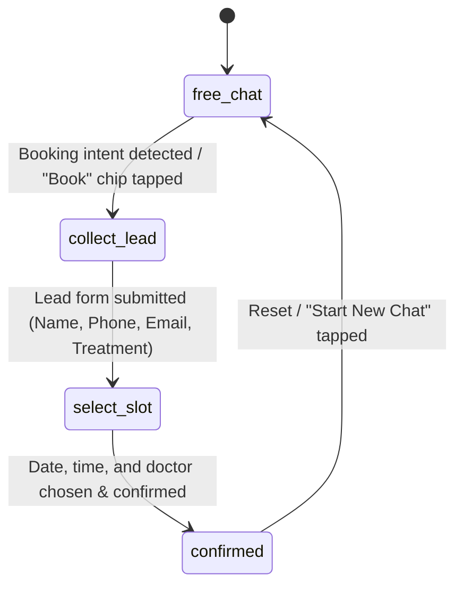

# Project Brain: DentalFlow AI

This file serves as the persistent memory, architectural index, and technical roadmap for **DentalFlow AI**. It provides onboarding context, coding standards, and active development state for developers and agentic coding assistants.

---

## 1. Project Overview & Context

*   **Product Name**: DentalFlow AI (SmartDocSystem Showcase)
*   **Startup / Agency**: SmartDocSystem Agency (founded by Shorup Ghosh)
*   **Target Market**: Premium cosmetic, implant, and specialty dental clinics in India (specifically Golf Course Road, Gurugram).
*   **Core Objective**: Transition dental clinics from passive sites to active patient-acquisition systems.
*   **Core Systems**:
    1.  **AI Growth Landing Site**: Conversion-focused, responsive showcase for clinic treatments, doctors, and smile transformations.
    2.  **AI Receptionist Chatbot**: A hybrid conversational receptionist that answer queries using Gemini and transitions into forms and calendar inputs to capture leads and schedule appointments.
    3.  **Clinic CRM Dashboard**: Real-time CRM desk for clinic admin staff to manage appointments, leads, reviews, and AI-driven workflows.

---

## 2. Technology Stack

*   **Framework**: React 19 (SPA) + Vite 8 + TypeScript 6
*   **Styling**: TailwindCSS v4 (using the `@tailwindcss/vite` plugin)
*   **Animations**: Framer Motion
*   **Icons**: Lucide React
*   **Analytics / Charts**: Recharts
*   **Backend & DB**: Supabase (PostgreSQL database with real-time replication)
*   **AI Engine**: Gemini API (`gemini-2.0-flash`)
*   **Automations**:
    *   **Email Alert**: Resend API (triggered client-side on successful booking)
    *   **SMS Alert**: Mock Twilio stage (triggers during appointment confirmations)
*   **Linter & Code Quality**: Oxlint

---

## 3. Directory Structure Map

```
dental-flow-ai/
├── .agents/                    # Agent-specific configurations & skills
│   └── skills/                 # Custom local Supabase skills
├── docs/                       # Project documentation
│   └── superpowers/
│       └── specs/              # Design & feature specifications
├── supabase/                   # Supabase migrations, functions & DB schema
│   ├── functions/              # Edge functions (if any)
│   ├── migrations/             # Migration SQL files
│   └── schema.sql              # Active database schema dump
├── src/                        # Core Application Source
│   ├── assets/                 # Images, custom stylesheets, and media
│   ├── components/             # Reusable UI Components
│   │   ├── pages/              # Landing page route components
│   │   │   ├── About.tsx       # Clinic bio and doctor lists
│   │   │   ├── Contact.tsx     # Location details and contact form
│   │   │   ├── Home.tsx        # Hero banner, call-to-actions, stats
│   │   │   ├── SmileGallery.tsx# Before-after dental work visualizers
│   │   │   └── Treatments.tsx  # Procedure categories and pricing guides
│   │   ├── AIReceptionist.tsx  # 24/7 Hybrid Chatbot overlay
│   │   ├── AdminDashboard.tsx  # CRM desktop for doctor & admin staff
│   │   ├── BookingWizard.tsx   # Multi-step scheduler widget
│   │   ├── Navbar.tsx          # Responsive navigation & dark-mode switcher
│   │   └── PatientPortal.tsx   # Mock portal for registered patients
│   ├── context/
│   │   └── DatabaseContext.tsx # Central State and DB connection logic
│   ├── lib/
│   │   ├── mockData.ts         # Seeding templates for local fallback mode
│   │   ├── supabase.ts         # Supabase client instantiation
│   │   └── utils.ts            # Tailwind styling utilities
│   ├── App.tsx                 # View controller and main layout wrapper
│   ├── index.css               # Core styling variables
│   └── main.tsx                # Mount target
├── package.json                # Project configurations & scripts
└── brain.md                    # THIS FILE (Project Context & Memory Bank)
```

---

## 4. Key Architectural Patterns & Flows

### 4.1 State Management (`DatabaseContext.tsx`)
The application operates on a **dual-database design**:
1.  **Live Supabase Sync**: If `VITE_SUPABASE_URL` and `VITE_SUPABASE_ANON_KEY` are defined, the app fetches data and writes updates to the Supabase PostgreSQL backend in real-time.
2.  **Local Mock Database**: If Supabase variables are absent, the application silently falls back to a memory-based database seeded from `src/lib/mockData.ts`. This allows full feature testing (adding leads, rescheduling appointments, answering reviews) entirely in the browser.
*   **Demo Controller (`src/App.tsx`)**: Rendered in the bottom-left of the screen, allowing users to toggle between Patient View, Patient Portal, Doctor Panel, and Admin CRM, while displaying the current database status (Live Supabase vs. Local Mock).

### 4.2 AI Receptionist State Machine
The chatbot in `src/components/AIReceptionist.tsx` transitions through four distinct states to guarantee conversion:



*   **`free_chat`**: Open conversational state. Gemini answers queries on treatments, pricing, and doctors using a custom injected system prompt. If the user expresses intent to book, the prompt instructs Gemini to output the string:
    `[LEAD_CAPTURED: Name="<name>", Phone="<phone>", Treatment="<treatment>"]`.
*   **`collect_lead`**: The conversational input is disabled, and an inline form is rendered asking for Name, WhatsApp Number, Email, and Treatment Interest.
*   **`select_slot`**: Renders a horizontal slider showing the next 14 calendar dates (automatically skipping Sundays). Allows choosing a specialist doctor and selecting from available time-slots based on their availability config.
*   **`confirmed`**: An animated success card summarizing booking details, mocking SMS/Twilio outputs, emailing confirmations via Resend, and syncing records directly to the CRM dashboard.

### 4.3 Database Schema & Tables
Key entities defined in `supabase/schema.sql`:
*   **`doctors`**: Core clinic team members, their profiles, specialties, and weekly calendar availability.
*   **`patients`**: Contact details and medical history.
*   **`appointments`**: Booked slots referencing `patient_id` and `doctor_id` with statuses: `Pending`, `Confirmed`, `Completed`, or `Cancelled`.
*   **`leads`**: Potential clinic prospects captured via the chatbot or landing forms. Includes `ai_score` (1-10 priority scale) and `ai_notes`.
*   **`reviews`**: Patients' feedback rating with doctor links and `ai_response` text blocks.
*   **`staff`**: Staff profiles and roles.

---

## 5. Design & Styling Guidelines

*   **Aesthetic Theme**: Sleek, modern, and dark-mode compatible. Employs card layouts, subtle borders, and glowing accents.
*   **Glassmorphism**: Glass layouts built with `backdrop-blur-xl bg-background/80 border border-border` combined with shadow panels.
*   **Color Palette**: Minimalist background, crisp border styling, with deep emerald/teal accent colors representing medical premium authority.
*   **Micro-interactions**: Uses `Framer Motion` for transitions on chat messages, page switches, and form completions. Use `cursor-pointer` on all click targets.
*   **Mobile First**: Fully responsive navbar, sidebars, grids, and chatbot widgets.

---

## 6. Recent Active Context & Roadmap

*   **Responsive Refactor**: Refactored the core application layouts, tables, and navbar to ensure 100% usability across mobile, tablet, and desktop screens.
*   **Chatbot Lead & Calendar Implementation**: Integrated the form and date selection widgets inside `AIReceptionist.tsx`, adding Sunday exclusion and doctor availability checks.
*   **Pending Integrations**:
    1.  Provisioning production Twilio API endpoint keys for automated WhatsApp notifications.
    2.  Verifying the Resend domain keys for transactional email automation.
    3.  Full staging deployment on Vercel / Netlify.
