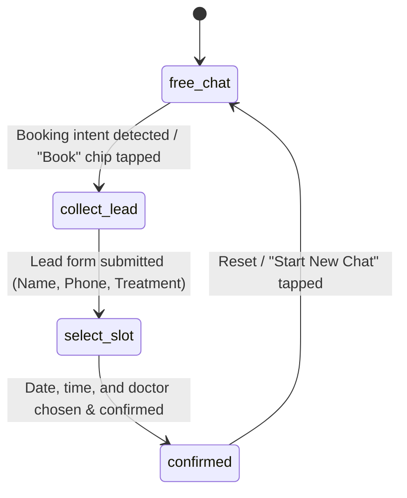

# Design Specification - DentalFlow AI Production Chatbot Redesign

**Date**: July 17, 2026  
**Status**: Approved  
**Topic**: Hybrid Interactive Chatbot & Native Calendar Scheduler  

---

## 1. Objective
Redesign the existing AI Receptionist chatbot (`src/components/AIReceptionist.tsx`) into a production-grade, highly reliable, and visually stunning patient acquisition funnel. The system will transition from a pure text conversation to a hybrid model that uses inline form widgets and a native 6-day calendar to guarantee lead capture and direct appointment scheduling.

## 2. Key Requirements
1. **Free-form Q&A**: Chatbot answers questions about treatments, clinic timings, pricing, and specialists using live data dynamically injected into the Gemini prompt context.
2. **Interactive Lead Capture Widget**: When booking intent is detected, standard chat input is locked and replaced by a form widget collecting Name, Phone, and Treatment Interest.
3. **6-Day Custom Calendar Widget**: Displays available booking slots over the next 14 days, completely skipping and disabling Sundays (Sundays are clinic holidays).
4. **Direct Supabase Scheduling**: Inserts leads into the `leads` table and schedules pending appointments directly into the `appointments` table.
5. **Real-time CRM Sync**: Updates the `DatabaseContext` state so appointments and leads immediately populate in the Admin Dashboard CRM in real-time.
6. **Auto Email Dispatch via Resend**: Upon successful booking, triggers direct transactional emails via Resend:
   - **To Patient**: Booking details, clinic address, and contact info.
   - **To Doctor**: Alert of new pending booking, patient name, treatment, phone number, and scheduled slot.

---

## 3. Architecture & Data Flow

### 3.1 State Machine
The chatbot UI will render elements based on the following flow states:
- `free_chat`: Chat message scroll-feed + text input bar. AI answers questions.
- `collect_lead`: Form card appears in feed. Standard text input is locked/disabled.
- `select_slot`: 6-day date slider + specialist selection dropdown + time slots grid (Morning, Afternoon, Evening).
- `confirmed`: Animated checkmark card summarizing the booking + option to reset.

### 3.2 Database & API Integrations
1. **Leads Table**:
   - Fields: `name`, `phone`, `message` (contains treatment interest), `source` (set to `'Website'`), `status` (set to `'New Lead'`).
   - Saved via `addLead` in `DatabaseContext.tsx`.
2. **Appointments Table**:
   - Fields: `patientId` (or fallback ID), `doctorId`, `treatmentName`, `scheduledAt` (ISO timestamp), `status` (set to `'Pending'`), `price`.
   - Saved via `createAppointment` in `DatabaseContext.tsx`.
3. **Email Alerts (Resend API)**:
   - Triggered on client-side upon appointment insert.
   - Endpoint: `https://api.resend.com/emails`
   - Authorization: Bearer `VITE_RESEND_API_KEY`
   - Sender: `DentalFlow AI <onboarding@resend.dev>` (default fallback, or verified domain)
   - Recipient: Patient email (if provided) and Doctor email (fetched from the active doctor record in `DatabaseContext`).

---

## 4. UI/UX & Component Details

### 4.1 Chat Window Layout
- Clean glassmorphism container (`backdrop-blur-xl bg-background/80 border border-border`).
- Smooth Framer Motion transitions for chat messages and cards.

### 4.2 Lead Form Card
- Input: Full Name (text).
- Input: WhatsApp Number (tel).
- Select: Treatment (dropdown populated with treatments and prices from mock/live DB).

### 4.3 Custom Calendar Card
- Horizontal slider showing the next 14 calendar dates.
- Sunday Filter: Date slots where `date.getDay() === 0` are excluded from the render list or greyed out.
- Doctor Select: Dynamic dropdown loaded from `doctors` list.
- Time Slots Grid:
  - Morning: 9:00 AM - 12:00 PM
  - Afternoon: 12:00 PM - 4:00 PM
  - Evening: 4:00 PM - 8:00 PM

---

## 5. Verification Plan

### 5.1 Automated Tests & Checks
- Compile verification: Run `npm run build` to verify clean typescript compiling.

### 5.2 Manual Verification Steps
1. Open the chatbot overlay on the home page.
2. Tap "Book Consultation" or type *"I want an implant treatment"*.
3. Verify transition to the **Lead Capture Form**. Submit details.
4. Verify transition to the **Calendar Card**.
   - Check that Sundays are disabled/omitted.
   - Select a doctor, date, and slot. Click confirm.
5. Check the developer console for Resend email network payloads.
6. Open the **Admin Dashboard** (under Portals) and verify that the lead and appointment instantly appear in the CRM table without a page reload.
